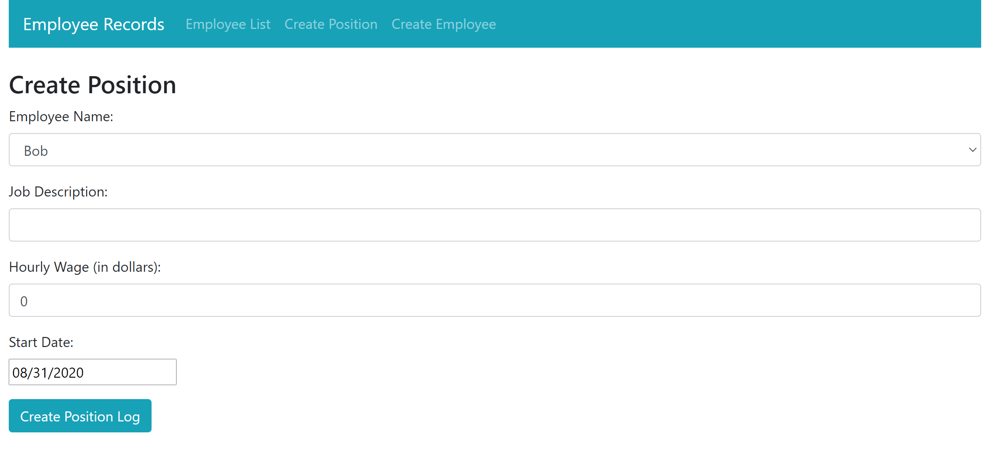
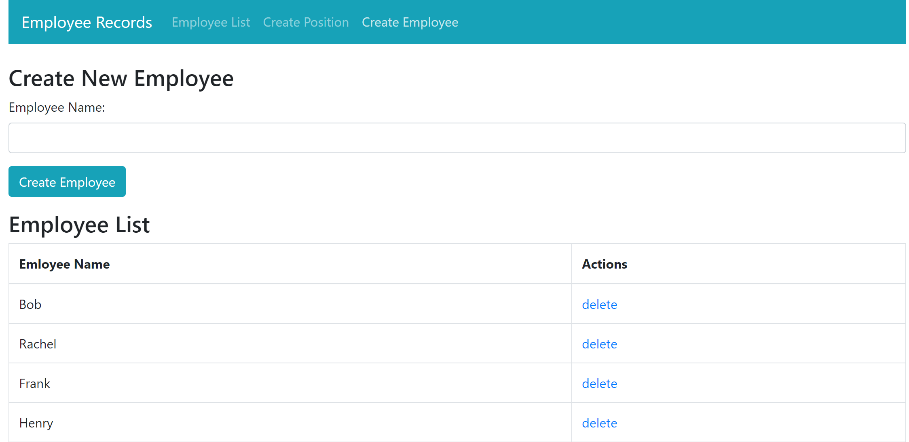

# Employee-Tracker
Application to keep track of employee's at a company

This is a web application that is used to record the employee record at a company.  In the application you can add new employee's, and add the employee's position at the company.  This information is then displayed where it can be edited or deleted.  This application was created with MongoDB Atlas, Express, React, and Node.

If you want to run this application you will need to:

1.Have a Node installed on your computer

2.Create a free MongoDB Atlas acount

3.Create a local cluster on MOngoDB Atlas

If you have all of these things the first thing you need to do is install the Create React App bootstrap. 
This can be done with the "npx create-react-app" comand followed by what you want to name the file.  One this is done dowload this repository.  Add the backend folder in your main app folder.  You will need to replace the Atlas_Url with the atlas usl for your MongoDb cluster.  Finally all you have to do is replace the public folder with the public folder from this repository and the src folder with the src folder from this repository.

Now you are all set.  To start the application all you have to do is enter the backend folder with your comand line and type in "nodemon server".  This will connect your app to your mongoDB database.  Finally you will have to enter the main project folder in your command line and type in "npm start".  This will start up the web application.

This project was bootstrapped with [Create React App](https://github.com/facebook/create-react-app).
