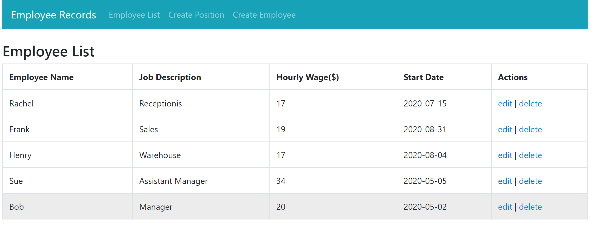

# Employee-Tracker
Application to keep track of employee's at a company

This is a web application that is used to record the employee record at a company.  In the application you can add new employee's, and add the employee's position at the company.  This information is then displayed where it can be edited or deleted.  This application was created with MongoDB Atlas, Express, React, and Node.

